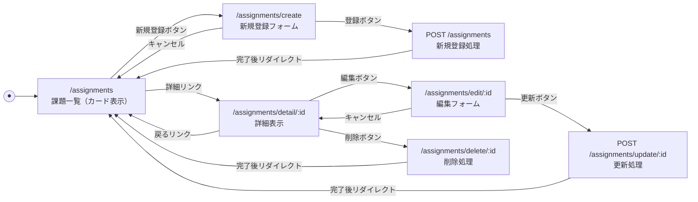

# 開発者向け仕様書(仮)
---


## 1. データ構造

本システムでは，課題データを `assignments` 配列（オンメモリ）として管理する．
各フィールドはUI上の表示効率および拡張性を考慮し，以下の通り定義する．

| 論理名 | 物理名 | 型 | 必須 | 説明 |
| :--- | :--- | :--- | :---: | :--- |
| ID | `id` | Integer | ◯ | 課題識別用ID（一意・自動採番） |
| 科目名 | `subject` | String | ◯ | 講義・科目の名称（例：Webプログラミング） |
| 課題タイトル | `title` | String | ◯ | 課題の件名（例：アジャイルワーク1レポート） |
| 提出期限 | `deadline` | String | ◯ | ISO 8601準拠の日付文字列（`YYYY-MM-DD`） |
| ステータス | `status` | String | ◯ | 状態管理（`未着手`, `進行中`, `完了`） |
| 詳細・メモ | `desc` | Text | - | 課題の詳細要件や個人的な備忘録 |

### データ例
```js

    "id": 1,
    "subject": "Webプログラミング",
    "title": "レポート課題",
    "deadline": "2025-12-28",
    "status": "進行中",
    "desc": "仕様書は，利用者向け，管理者向け，開発者向けの3部構成"

```

## 2. ページ遷移図



## 3.リソースごとの機能詳細

### 3.1 課題一覧 (`/assignments`)

- **デザイン**
  - **カードレイアウト**: 課題一つひとつをカードとして表現し，視認性を高める．
  - **期限の強調**: 提出期限が近いもの（例：3日以内）は赤字やアイコンで強調表示し，ユーザーの注意を喚起する（注意の誘導）．
  - **ステータスバッジ**: 「未着手（グレー）」「進行中（青）」「完了（緑）」を色分けし，直感的に状況を把握させる．
  - 課題が0件の場合は，「現在課題はありません．」等のメッセージと，新規登録ボタンを目立たせて表示する．
- **ソート機能**: デフォルトで「提出期限が近い順」に並び替えて表示する．

### 3.2 詳細表示 (`/assignments/detail/:id`)

- **UI面**: タイトルを最上部に大きく配置し，その直下に期限とステータスを配置する．詳細はその下に表示する．
- **ナビゲーション**
  - 「一覧に戻る」リンクを分かりやすい位置（左上など）に配置．
  - 「編集」「削除」は誤操作防止のため，色味を変える（編集＝プライマリカラー，削除＝危険色）．

### 3.3 新規登録・編集フォーム (`.../create`, `.../edit/:id`)

- **入力**
  - **科目名・タイトル・期限**: 必須入力とする．未入力時， `required` 属性およびサーバーでのチェックを行う．
  - **ステータス**: 新規登録時はデフォルトで「未着手」を選択状態にする．
- **UI面**
  - プレースホルダーを活用し，入力例（例：「Webプログラミング」）を提示する．
  - 保存ボタンは「送信」ではなく「登録する」「更新を保存」など，具体的な操作名にする．

### 3.4 削除処理 (`.../delete/:id`)

- **サーバー処理**
   -  **パラメータ取得**: URLパラメータから削除対象の課題ID (`id`) を取得する．
  - **配列検索**: `assignments` 配列を検索し，該当する `id` を持つ要素が配列の何番目（index）にあるかを特定する．
  - **配列操作**: 特定した配列に対し，JavaScriptの標準メソッド `splice(index, 1)` を実行し，要素を削除する．
  - **リダイレクト**: `res.redirect('/assignments')` を実行し，更新された一覧画面を表示する．
